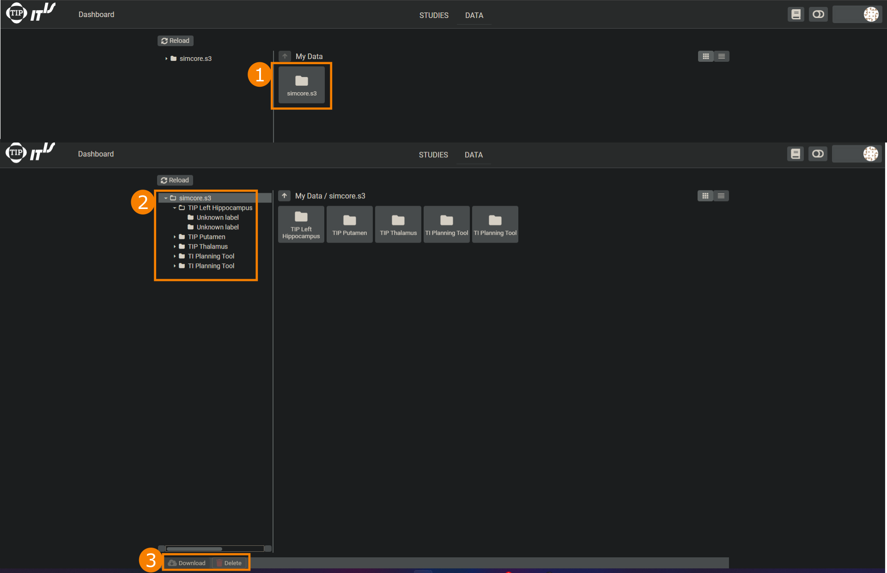

### Data

The second tab available on the top of the **Dashboards** screen is the ```Data``` tab.

<p align="center">
  
</p>


When changing to this section, you are presented with the file system of your account on o<sup>2</sup>S<sup>2</sup>PARC. You can navigate, delete, and download files, such as logs or the input/output data of Services. Two principal views are available: an icon and a list view - the latter provides additional information about the file size and the last modification date. Occasionally, it can be necessary to click the ```Reload``` button to refresh the file system tree.

For more information, see the [o<sup>2</sup>S<sup>2</sup>PARC User Manual](https://docs.osparc.io/#/).
