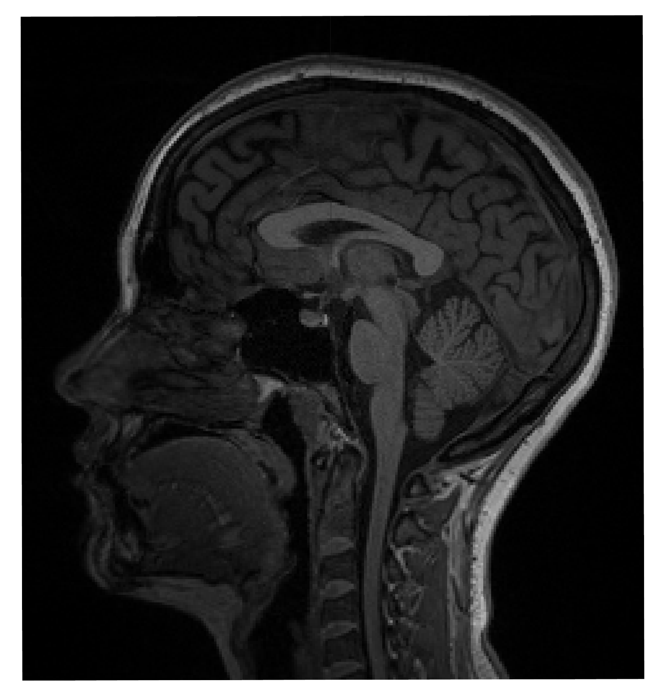
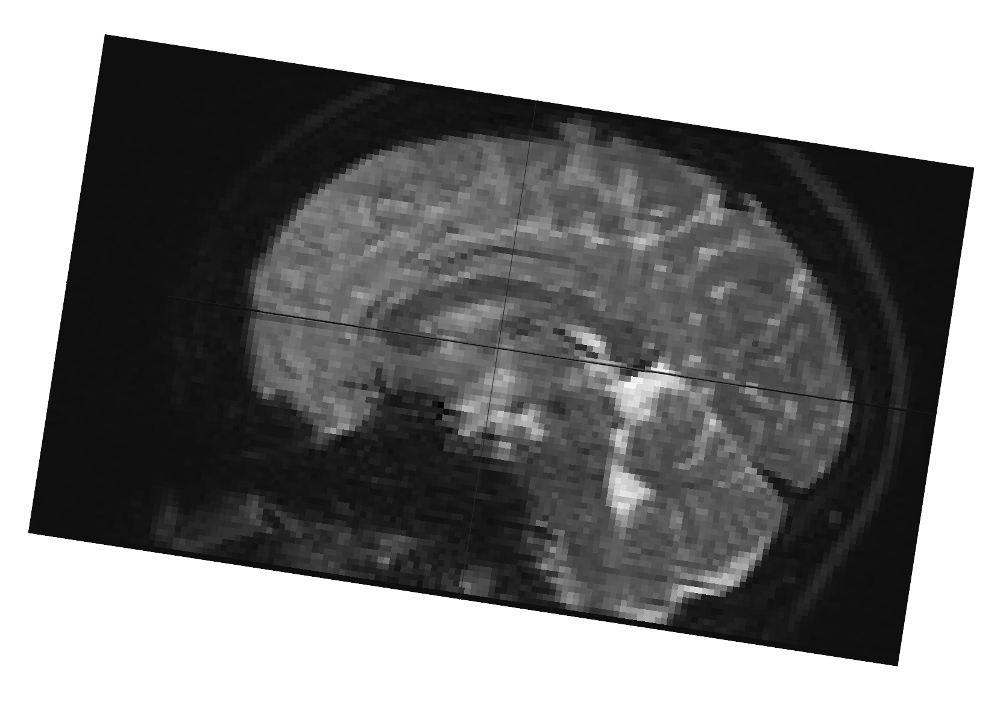

## Uploading Your Data

**_Summary_**: 

_During the **Setup** step, an anatomical model and an electrode shape and placement are chosen, the target structure is specified, and the huge search space is narrowed down by selecting potential electrode placement regions._

----

This preparatory step is crucial for smooth operation of the pipeline. If you choose to follow the personalized pipeline, you have the prepare your data according to our acceptable formatting and setting.

  
  

