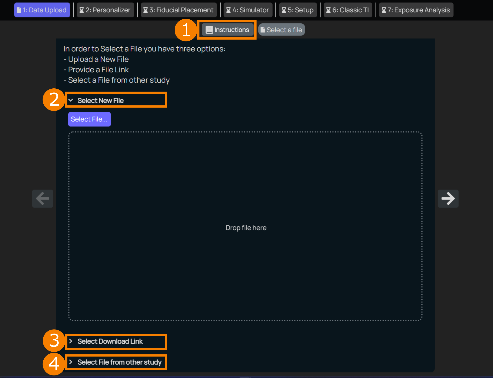
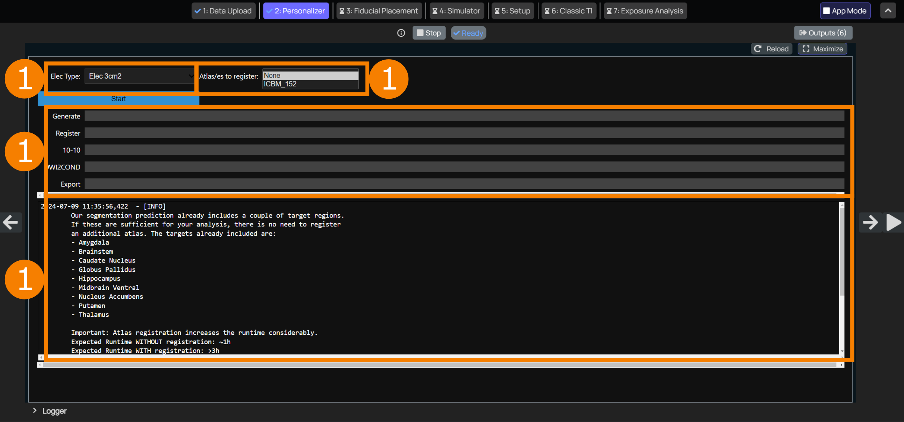

## Images Processing

**_Summary_**: 

_During the **Setup** step, an anatomical model and an electrode shape and placement are chosen, the target structure is specified, and the huge search space is narrowed down by selecting potential electrode placement regions._

----

As the initial step for personalization, the user is asked to provide, in the file picker, the data you want to work with. Here you have two options: building an isotropic model which only requires a T1-weighted MR image, or an anisotropic model which requires a DTI with bval & bvac files on top of the T1. If the anisotropic option is desired, all four files should be zipped together.

<table style="width: 100%; border-collapse: separate; border-spacing: 10px;">
<tr>
<td style="padding-left: 50px; vertical-align: top;">

- 📃 `subject_t1.nii.gz`

</td>
<td style="vertical-align: top;">

- 📂 `input_data.zip/`
  - 📃 `subject_t1.nii.gz`
  - 📃 `subject_dti.nii.gz`
  - 📃 `subject_dti.bvec`
  - 📃 `subject_dti.bval`

</td>
</tr>
</table>

<br>
<p align="center">
  
</p>

1. **Data Instructions**
   A brief summary of what files and formates are needed, image quality recommendations and a reminder to annonymize the data before uploading.
2. **Upload Option 1**
   Select a file using the file explorer by clicking on ```Select File``` or directly drag and drop the the data to the designated area.
3. **Upload Option 2**
   If the data is already available online somewhere (eg. Google Drive or Dropbox), given that the sharing is set to public, the link can be provided.
4. **Upload Option 3**
   In case data already uploaded to TIP in a different study shall be reused, it can be selected from TIP's data explorer.

Once uploaded, the user can specify the geometry of the electrode, and if the head should be registered to the ICBM_152 atlas for cortical structures. By clicking start, the anatomical model is generated. Computational time is approximated to be ~1h, and can increase to ~2.5h if cortical atlas registration is selected. The computation is done when a tick-icon appears on the previously pushed start button. The user can go to the next step by pressing the arrow on the right.

<br>
<p align="center">
  
</p>

The **_Setup_** interface has the following elements:

1. **_Select Species_** <br/>
   Depending on the TI exposure to be planned, a human or mouse model with associated standard electrode locations is selected here via the drop-down list. The list of available models will continue to expand in the near future.

2. **_Select Target Structure_** <br/>
   The brain structure that should be targeted by TI is specified here via the drop-down list. All the exposure quality metrics will be calculated according to the selected structure. 

3. **_Select Electrode Shape_** <br/>
   The shape of the electrode is selected here via the drop-down list. Currently the circular shape is available only.
   
4. **_Select Electrode Dimensions_** <br/>
   The dimension of the electrode is set here via the drop-down list. Currently the area of 3cm<sup>2</sup> is available only.
   
5. **_Electrode Pair Candidates_** <br/>
   Electrode position candidates are interactively selected here. Click ```+``` button next to _Start selecting_ under each _Pair_ and then click on the location in the diagram to add. The selected electrode pair locations will be highlighted with the same color (Blue for _Pair 1_ and Yellow for _Pair 2_). Click the icon next to candidate electrode under _Pair_ list to unselect it. E*n* + and E*n* - correspond to candidate locations for the two electrodes that make up the *n*-th pair. All permutations of the candidates locations are then evaluated as part of the optimization process.


Once you are finished with the setup, you can press ```Finish set up```. This will relay all the required information to the **Optimizer** for the evaluation. If settings are changed after submitting, the ```Finish set up``` button turns orange to indicate that the optimization results are outdated. Settings can then be resubmitted and the **Optimizer** is executed once more to update the pipeline, and the button color reverts to the standard color.

You can now click to the arrow on the right side of the browser to move to [**_Optimal Configuration Identification_**](/docs/services/post_processing.md).
